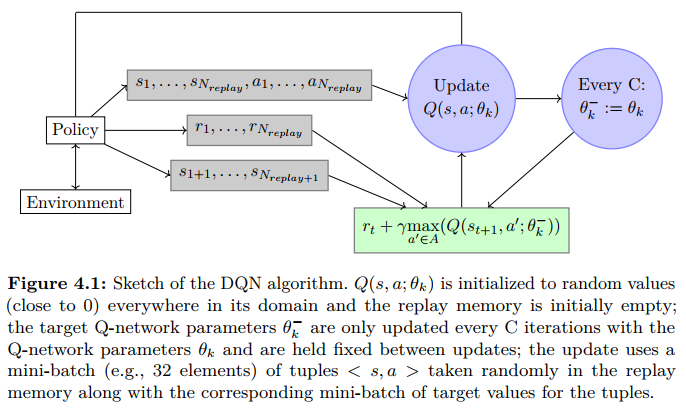

# Deep Reinforcement Learning

## Reinforcement Learning

### 概述

RL可以被形式化地描述为 一个agent在一个环境中进行一系列决策来最大化累积奖励

RL有两个关键

* agent学习好的行为，它会增量式地修改和获取新的行为和技能
* 不同于动态规划需要全部的环境信息作为先验，RL使用试错经验（**trial-and-error experience**），不需要完整的信息或控制环境，只需要能和环境交互、搜集信息即可

RL分为在线和离线两种设定

* 离线设定中，经验作为先验得到，然后用作学习的batch，因此离线设定也被叫做批量强化学习（batch RL）。学习过程中，不与环境进行交互，只从dataset中直接学习，而dataset是采用别的策略收集的数据，并且采集数据的策略并不是近似最优策略

* 在线设定中，数据必须按顺序得到，用以逐步更新agent的行为。学习过程中，agent需要和环境进行交互。在线强化学习又可分为on-policy RL和off-policy RL。

### 形式框架

#### 设定

一般的RL问题被形式化为离散时间随机控制过程

agent以如下方式和环境交互：

* 给定环境中的一个状态$s_0\in\mathcal{S}$，agent收集初始观测值$\omega_0\in\Omega$

* 在每个时间步$t$下

  * agent采取动作$a_t\in\mathcal{A}$

  * agent获得一个奖励$r_t\in\mathcal{R}$

  * 当前状态转移到$s_{t+1}\in\mathcal{S}$

  * agent获得一个新的观测值$\omega_{t+1}\in\Omega$

#### Markov性质

$$
P(\omega_{t+1}|w_t,a_t)=P(\omega_{t+1}|\omega_t,a_t,\cdots,w_0,a_0)\\
P(r_{t}|w_t,a_t)=P(r_{t}|\omega_t,a_t,\cdots,w_0,a_0)
$$

Markov性质意味着未来的过程仅取决于当前的观察，而不关心整个过去

##### Markov决策过程（MDP)

一个MDP可以用一个五元组描述$(\mathcal{S},\mathcal{A},T,R,\gamma)$

* $\mathcal{S}$是状态空间
* $\mathcal{A}$是动作空间
* $T:\mathcal{S}\times\mathcal{A}\times\mathcal{S}\to[0,1]$是转移函数，表示两个状态之间的条件转移概率
* $R:\mathcal{S}\times\mathcal{A}\times\mathcal{S}\to\mathcal{R}$为奖励函数，其中$\mathcal{R}$是区间$[0,R_{max}]$内实数集合，$R_{max}\in\mathbb{R}^+$

* $\gamma\in[0,1)$是一个折扣因子

在MDP中，系统是完全可观测的，即$\omega_t=s_t$，每一步状态转移的概率和所获得的奖励分别由函数$T,R$给出

#### Policy(策略)

策略决定了agent如何选择动作

策略可以根据静态和非静态分为两类，非静态策略依赖于时间步，对于有限视野的上下文很有用，也就是累积奖励受限在有限的未来时间步的情况

在后续深度RL介绍中，考虑的是无限视野，策略是静态的

策略也可以分为确定和随机两种

* 在确定情况下，策略可以描述为$\pi(s):\mathcal{S}\to\mathcal{A}$

* 在随机情况下，策略可以描述为$\pi(s,a):\mathcal{S}\times\mathcal{A}\to[0,1]$，表示状态$s$下选择动作$a$的概率

#### 期望奖励

##### $V$值函数（状态价值函数）

考虑一个RL的agent的目标是找到一个策略$\pi(s,a)\in\Pi$，从而最大化期望奖励$V^\pi(s):\mathcal{S}\to\mathbb{R}$，也被叫做$V$值函数
$$
V^\pi(s)=\mathbb{E}[\sum_{k=0}^\infty\gamma^{k}r_{t+k}|s_t=s,\pi]
$$
其中

* $r_t=\mathbb{E}_{a\sim\pi(s_t,\cdot)}R(s_t,a,s_{t+1})$

* $P(s_{t+1}|s_t,a_t)=T(s_t,a_t,s_{t+1})$，其中$a\sim\pi(s_t,\cdot)$

定义最优的$V$值函数为$V^*(s)$，表示只给定状态$s$，此后遵循最优策略$\pi^*$能得到的折扣奖励期望
$$
V^*(s)=\max_{\pi\in\Pi}V^\pi(s)
$$

##### $Q$值函数（状态-动作价值函数）

除了$V$值函数，还有$Q$值函数$Q^\pi(s,a):\mathcal{S}\times\mathcal{A}\to\mathbb{R}$
$$
Q^\pi(s,a)=\mathbb{E}[\sum_{k=0}^\infty\gamma^{k}r_{t+k}|s_t=s,a_t=a,\pi]
$$
在MDP下，上式可重写为
$$
Q^\pi(s,a)=\sum_{s'\in\mathcal{S}}T(s,a,s')\left(R(s,a,s')+\gamma Q^\pi(s',a=\pi(s'))\right)
$$
类似地，定义最优$Q$值函数为$Q^*(s,a)$，表示给定了状态$s$和动作$a$，此后遵循最优策略$\pi^*$能得到的折扣奖励期望
$$
Q^*(s,a)=\max_{\pi\in\Pi}Q^\pi(s,a)
$$
我们可以直接从$Q^*(s,a)$获得$s$下的最优策略
$$
\pi^*(s)=\mathop{\arg\max}_{a\in\mathcal{A}}Q^*(s,a)
$$
两个函数的区别在于

* $V$值函数表示，仅给定了状态$s$，并使用关于动作的概率分布$\pi(s,\cdot)$建模策略$\pi$，之后遵循$\pi$能获得的折扣奖励期望，评估的是一个状态的好坏
* $Q$值函数表示，给定了状态$s$以及动作$a$，并使用确定性的$\pi(s)$建模策略$\pi$，之后遵循$\pi$能获得的折扣奖励期望，评估的是一个状态下执行某个动作的好坏

由上，我们还可以定义advantage函数
$$
A^\pi=Q^\pi(s,a)-V^\pi(s)
$$
上面这个函数通过与直接遵循策略$\pi$得到的折扣奖励期望对比，刻画了动作$a$的好坏程度

#### 用于学习policy的不同部分

一个agent一般包含以下的一个或多个部分

* 一个估值函数，预测一个状态或(状态，动作)二元组的好坏

* 策略的表示，$\pi(s)$或$\pi(s,a)$

* 对环境的建模，如，估计的转移函数和估计的奖励函数

前两项是模型无关的，而如果使用了最后一项，则被称作基于模型的强化学习(**model-based RL**)

现实世界中的问题，状态空间一般都是高维的，因此使用深度学习的RL有两个优势：

* 神经网络适合处理高维输入，并且往状态空间或动作空间添加维度时，不需要指数级增长的数据

* 神经网络可以增量式训练

#### 用于学习policy的不同设定

##### 离线与在线学习

两者的核心学习算法基本相同

离线设定的特殊性在于，agent只能从有限的数据中学习，而不能和环境进一步交互

在线设定中，agent在学习的同时，还要逐渐从环境中搜集经验。考虑到采样效率的问题，不能要求大量的数据，agent采用**exploration/exploitation**策略来搜集经验，此外agent使用**replay memory**存储经验以便之后重新处理

##### off-policy和on-policy

在线设定中，又分为off-policy和on-policy两种方法，区别在于其采用的策略

* 行为策略（Behavior Policy）：用来与环境互动产生数据的策略，即在训练过程中做的决策
* 目标策略（Target Policy）：在行为策略产生的数据中不断学习、优化，即学习训练完毕后拿去应用的策略

On-policy 的目标策略和行为策略是同一个策略，但容易因为失去探索性而陷入局部最优

Off-policy将目标策略和行为策略分开，可以在保持探索的同时，更能求到全局最优值

## Value-based methods for deep RL

### Bellman方程

$V$值函数的Bellman方程
$$
\begin{align}
V^\pi(s)&=\mathbb{E}[\sum_{k=0}^\infty\gamma^{k}r_{t+k}|s_t=s,\pi]\\
&=\mathbb{E}[r_t+\gamma\sum_{k=0}^\infty\gamma^{k}r_{t+1+k}|s_t=s,\pi]\\
&=\sum_{a\in\mathcal{A}}\pi(s,a)\sum_{s'\in\mathcal{S}}P(s'|s,a)\left(R(s,a,s')+\gamma\mathbb{E}\left[\sum_{k=0}^{\infty}\gamma^kr_{t+1+k}|s_{t+1}=s',\pi\right]\right)\\
&=\sum_{a\in\mathcal{A}}\pi(s,a)\sum_{s'\in\mathcal{S}}P(s'|s,a)\left(R(s,a,s')+\gamma V^{\pi}(s')\right)
\end{align}
$$
$Q$值函数的Bellman方程
$$
\begin{align}
Q^{\pi}(s,a)&=\mathbb{E}[\sum_{k=0}^\infty\gamma^{k}r_{t+k}|s_t=s,a_t=a,\pi]\\
&=\mathbb{E}[r_t+\gamma\sum_{k=0}^\infty\gamma^{k}r_{t+1+k}|s_t=s,a_t=a,\pi]\\
&=\sum_{s'\in\mathcal{S}}P(s'|s,a)\left(R(s,a,s')+\gamma\mathbb{E}\left[\sum_{k=0}^{\infty}\gamma^kr_{t+1+k}|s_{t+1}=s',a_{t+1}=\pi(s'),\pi\right]\right)\\
&=\sum_{s'\in\mathcal{S}}P(s'|s,a)\left(R(s,a,s')+\gamma Q^{\pi}(s',\pi(s'))\right)\\
\end{align}
$$
其中$P(s'|s,a)=T(s,a,s')$

如果有一个策略$\pi^*$满足
$$
V^{\pi^*}(s)\ge V^{\pi}(s)\\
\forall \pi\in\Pi, s\in\mathcal{S}
$$
则称$\pi^*$是最优策略

令$V^*$表示某个最优策略$\pi^*$下的最优价值函数，因此它也满足$V$值函数的Bellman方程。

又因为它是最优值函数，所以$V^*$的Bellman方程可以写成特殊的形式，而无需参考任何特定的策略。

给出$V^*$的Bellman方程（也称Bellman最优方程）
$$
V^*(s)=\max_a\sum_{s'\in\mathcal{S}}P(s'|s,a)\left(R(s,a,s')+\gamma V^{*}(s')\right)
$$
 直观地，Bellman最优方程表达了这样一个事实，最优策略下的状态价值等于该状态下最佳动作的期望奖励：

类似地，我们可以得到$Q^*$的Bellman方程
$$
Q^*(s,a)=\sum_{s'\in\mathcal{S}}P(s'|s,a)\left(R(s,a,s')+\gamma\max_{a'\in\mathcal{A}}Q^{*}(s',a')\right)
$$

### Q-learning

基础版本的Q-learning利用上式维护一张$Q$值表，通过与环境交互，不断更新$Q(s,a)$的值，直到收敛

这个方法的收敛性基于压缩映射原理，收敛条件是

* 状态-动作对可以被离散表示
* 在所有状态下所有的动作可以被重复采样（保证充分的探索）

若状态空间或动作空间很高维，甚至是连续的，则上述的方法不可行

### Fitted Q-learning

fitted Q-learning使用参数化的$Q$值函数$Q(s,a;\theta)$

算法开始时，将$Q$值函数随机初始化为$Q(s,a;\theta_0)$，其中$\theta_0$表示初始参数，一般使$Q$值接近0

在第$k$个迭代下，$Q(s,a;\theta_k)$的更新目标为
$$
Y_k^Q=r+\gamma\max_{a'\in\mathcal{A}}Q(s',a';\theta_k)
$$
其中$r$表示得到的实际奖励

#### neural fitted Q-learning(NFQ)

在NFQ中，状态作为神经网络的输入，然后为每个可能的动作提供不同的输出。它提供了一种方式，对给定的$s'$求$\max_{a'\in\mathcal{A}}Q(s',a';\theta_k)$

因此，用神经网络$Q(s,a;\theta_k)$参数化$Q$值函数，最小化损失函数
$$
L_{DQN}=(Q(s,a;\theta_k)-Y^Q_k)^2
$$
$\theta_k$通过梯度下降更新
$$
\theta_{k+1}=\theta_k-\alpha\nabla_{\theta_k}L_{DQN}=\theta_k+\alpha(Y^Q_k-Q(s,a;\theta_k))\nabla_{\theta_k}Q(s,a;\theta_k)
$$
这里使用平方误差，是为了让$Q(s,a;\theta_k)$趋于$Y^Q_k$的期望值。从而在神经网络非常适合这个任务并且经验搜集足够充分的假设下，在足够多的迭代后，可以确保$Q(s,a;\theta_k)$趋于$Q^*(s,a)$

参数$\theta_k$更新时，目标$Y^Q_k$也会改变

由于神经网络的泛化和外推能力，在状态空间中的不同位置可能会有较大误差，误差会随着更新而传播

Bellman算子的压缩映射性质不足以保证这种方法能收敛

### Deep Q-network(DQN)

DQN沿用了NFQ的思想，并采用了一些启发式的方法来缓解上述的不稳定情况

* 目标$Y^Q_k$中的$Q(s',a';\theta_k)$替换为$Q(s',a';\theta^-_k)，$每$C\in\mathbb{N}$次迭代$\theta^-_k$才用$\theta^-_k=\theta_k$更新一次，即$C$次迭代中$Y^Q_k$保持固定

$$
Y^{DDQN}_k=r+\gamma \max_{a'\in\mathcal{A}}Q(s',a';\theta_k^-)
$$

* 使用了replay memory，通过$\epsilon-greedy$策略来搜集经验，并保留最后$N_{replay}\in\mathbb{N}$步的信息。每次更新，从replay memory中随机抽取一个元组$\langle s,a,r,s'\rangle$的集合（称为一个mini-batch)，进行训练，更新参数

* 将奖励限制在$[-1,1]$来限制梯度误差的规模

### Double DQN(DDQN)

上述的方法中，动作的选择（从当前状态中选择$Q$值最大的动作）和动作的评估（用当前奖励$r_t$与后继状态的最优$Q$值的和来计算目标$Q$值）都是通过对相同的$Q$值函数进行$\max$操作得到的

这意味着，目标$Q$值$Y^Q_k$和$Q$值有很强的相关性，$Q$值的偏移，也会导致目标$Q$值的偏移，$Q$又因为$\max$操作，最终会导致对$Q$值的过高估计

DDQN通过将$Y^Q_k$替换为$Y^{DDQN}_k$，解耦了动作选择和动作评估两个计算
$$
Y^{DDQN}_k=r+\gamma Q(s',\mathop{\arg\max}_{a\in\mathcal{A}}Q(s',a;\theta_k);\theta^-_k)
$$
这会减少对$Q$值的高估，提高稳定性

### Dueling network architecture

此方法将$Q$值函数用$V$值函数和优势函数建模
$$
Q(s,a)=V(s)+A(s,a)
$$
然而这样建模，会失去辨识性，即神经网络无法辨识哪个分支是$V$值函数，哪个分支是优势函数

为解决上述问题，提出如下定义
$$
Q(s,a;\theta^{(1)},\theta^{(2)},\theta^{(3)})=V(s;\theta^{(1)},\theta^{(3)})+(A(s,a;\theta^{(1)},\theta^{(2)})-\max_{a'\in\mathcal{A}}A(s,a';\theta^{(1)},\theta^{(2)}))
$$

这样，对于$a^*=\mathop{\arg\max}_{a'\in\mathcal{A}}Q(s,a';\theta^{(1)},\theta^{(2)},\theta^{(3)})$，可以得到$Q(s,a^*;\theta^{(1)},\theta^{(2)},\theta^{(3)})=V(s;\theta^{(1)},\theta^{(3)})$

即强制使选择的动作$a^*$的优势函数为0

但在实践中，一般采用如下方法
$$
Q(s,a;\theta^{(1)},\theta^{(2)},\theta^{(3)})=V(s;\theta^{(1)},\theta^{(3)})+(A(s,a;\theta^{(1)},\theta^{(2)})-\frac{1}{|\mathcal{A}|}A(s,a';\theta^{(1)},\theta^{(2)}))
$$
上式虽然丢失了$V$和$A$原始的语义，但可以获得更好的稳定性，优势函数的变化只要跟得上均值即可

这种方法只是修改了拟合$Q$值函数的神经网络的结构，因此可以直接用在DQN或DDQN上

## Policy gradient methods for deep RL

### Stochastic policy gradient

从给定状态$s_0$出发，使用随机策略$\pi$，奖励期望如下
$$
V^\pi(s_0)=\int_{\mathcal{S}}\rho^{\pi}(s)\int_{\mathcal{A}}\pi(s,a)R'(s,a)\,da\,ds
$$
其中

* $\rho^{\pi}(s)=\sum_{t=0}^\infty\gamma^tP$
* $$
