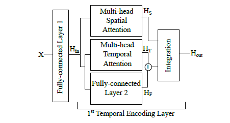
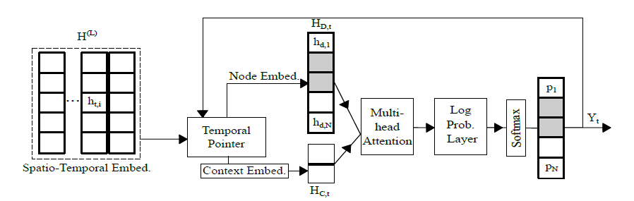
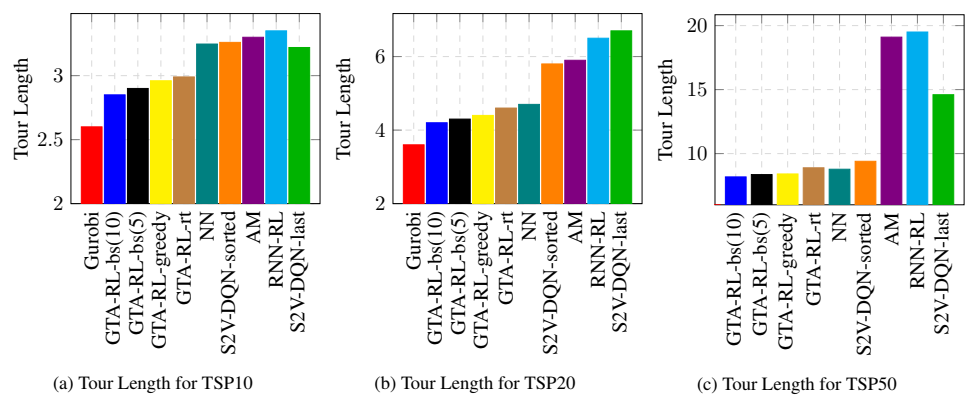
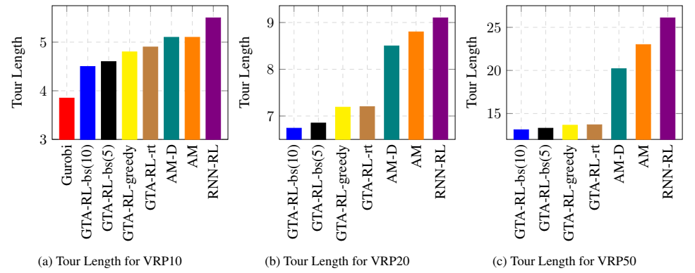

# Solving Dynamic Graph Problems with Multi-Attention Deep Reinforcement Learning

## 背景

图问题，如TSP问题和最小斯坦纳生成树问题，在数据工程和计算机科学中被广泛研究

而在实际应用中，图的特征往往会随着时间而变化

现有的启发式近似寻优算法一般仅适用于静态图

本文作者提出了一种名为**Graph Temporal Attention with Reinforcement Learning (GTA-RL) **的架构，来解决基于图的动态组合优化问题

## 本文工作

### 符号说明与问题描述

给定图$G$，图上节点为$X=\{x_1,x_2,\cdots,x_n\}$，其中$x_i = \{x_{0,i},x_{1,i},\cdots,x_{T-1,i}\}\in R^{T \times D}$

$T$为时间轴长度，$D$为节点特征维数

目标是找到一个长度为$T_s$的节点序列$Y$，满足约束$C(Y)$的前提下，最小化目标函数
$$
P_{obj}(Y|G)=\sum_{t=1}^{T_s}f_c(x_{t,y_t},x_{t+1,y_{t+1}})
$$
其中$f_c$计算一个节点到另一个节点的代价，与具体问题有关

使用策略梯度方法来进行学习，参数化$\pi_{\theta}(Y|G)=Pr(Y|G)$
$$
\pi_{\theta}(Y|G)=\prod_{t=1}^T\pi_{\theta}(y_t|G_{1:t-1},Y_{1:t-1})
$$
### Graph Temporal Attention
主要分为编码器和解码器两部分
#### Encoder

对输入$X\in R^{T\times N \times D}$,先使用一个全连接层得到$H_{in}\in R^{T\times N\times D^h}$

对于$H_{in}$分别使用时间注意力和空间注意力
##### Spatial Attention
使用三个权重向量$wS_q\in R^{D^h\times D^h}$，$wS_k\in R^{D^h\times D^h}$，$wS_v\in R^{D^h\times D^h}$

对于每个时间步$t$，令$H_{S,t}=\{h_{1,t},h_{2,t},\cdots,h_{N,t}\}\in R^{N\times D^h}$

计算三个投影向量，如下
$$
qS_t=H_{S,t}wS_q\in R^{N\times D^h} \\
kS_t=H_{S,t}wS_k\in R^{N\times D^h} \\
vS_t=H_{S,t}wS_v\in R^{N\times D^h}
$$
计算注意力系数
$$
\alpha_t=\mathbf{softmax}(\frac{qS_t\cdot(kS_t)^T}{\sqrt{D^h}})\in R^{N\times N}
$$
$\alpha_{t,i,j}$表示$t$时刻节点$i,j$间的注意力系数，若$i,j$间没有连边，则置为$-\infty$

计算每个节点在时间$t$下的表示
$$
H'_{S,t}=\alpha_t \cdot vS_t\in R^{N\times D^h}
$$
按时间轴堆叠，得到空间embedding$H'_S$
$$
H'_S=||_{t=1}^{T}H'_{S,t}\in R^{T\times N \times D^h}
$$
##### Temporal Attention
将会随时间改变的节点和不会改变的节点分开考虑

对于固定的节点$H_F\in R^{T\times U \times D^h}$，使用全连接层,得到$H'_F\in R^{T\times U \times D^h}$

对于会随时间改变的节点$H_T \in R^{T\times (N-U) \times D^h}$

类似地，使用三个权重向量$wT_q\in R^{D^h\times D^h}$，$wT_k\in R^{D^h\times D^h}$，$wT_v\in R^{D^h\times D^h}$

对于其中的每个节点$H_{T,i}={h_{i,1},h_{i,2},\cdots,h_{i,T}}\in R^{T\times D^h}$

计算三个投影向量
$$
qT_i=H_{T,i}wT_q\in R^{T\times D^h} \\
kT_i=H_{T,i}wT_k\in R^{T\times D^h} \\
vT_i=H_{T,i}wT_v\in R^{T\times D^h}
$$
计算注意力系数
$$
\beta_i=\mathbf{softmax}(\frac{qT_i\cdot(kT_i)^T}{\sqrt{D^h}})\in R^{T\times T}
$$
$\beta_{i,t_a,t_b}$表示时刻$t_a$下的节点$i$与时刻$t_b$下的节点$i$间的注意力系数

计算节点$i$在每个时刻下的表示
$$
H'_{T,i}=\beta_t \cdot vT_i\in R^{T\times D^h}
$$
将所有可变节点的$H'_{T,i}$堆叠，得到$H'_T$
$$
H'_T=||_{i=1,i\notin U}^{N}H'_{T,i}\in R^{(N-U)\times T \times D^h}
$$
再将$H'_F$和$H'_T$拼接得到最终的时间embedding
$$
H'_{TF}=H'_F||H'_T\in R^{N\times T \times D^h}
$$
##### 多头注意力

时间注意力和空间注意力均使用多头注意力机制

令$M$为注意力的head数

以空间注意力为例，将上述的$$wS_q，wS_k，wS_v$$的维度改为$R^{D^h\times \frac{D^h}{M}}$，得到每个注意力下的$H'_{S,t}$为$R^{N\times \frac{D^h}{M}}$

再通过拼接的方式，将$M$个注意力下的embedding合并

时间注意力同理

##### 融合层

将空间注意力下的embedding $H'_S$和转置后的时间注意力下的embedding $H'_{TF}$拼接，得到$H'_S||H'_{TF}\in R^{T\times N \times 2*D^h}$

再使用权重参数$wI\in R^{D^h \times 2*D^h}$，得到
$$
H_{out}=\sigma(wI\cdot(H'_S||H'_{TF}))\in R^{T\times N \times D^h}
$$
$H_{out}$可以再作为Encoder的输入，即使用多层的Encoder

#### Decoder

将最后一层Encoder的输出$H^{(L)}$作为解码器的输入

$H_{D,t}$应该是$H^{(L)}[t, : , : ]\in R^{N\times D^h}$

##### Context Embedding

对于每个时间点$t$

计算context embedding $H_{C,t}=f_{cnxt}(H^{(L)}_t,Y_t)\in R^{K*D^h+e}$，其中$f_{cnxt},K,e$与具体的求解问题有关

在TSP中，作者设计
$$
H_{C,t}=h_{y_0}^{(L)}||h_{y_t}^{(L)}||H_{G,t}\\
H_{G,t}=\sum_{i=1}^Nh_{t,i}^{(L)}
$$
在VRP中
$$
H_{C,t}=h_{y_t}^{(L)}||r||H_{G,t}
$$
其中$H_{G,t}$同上，$r$为车辆的剩余容量

##### Multi-head Attention

使用权重参数$wC_q\in R^{(K*D^h+e)\times D^h},wC_k\in R^{D^h\times D^h},wC_v\in R^{D^h\times D^h}$

计算投影向量
$$
qC_t=H_{C,t}wC_q\in R^{N\times D^h} \\
kC_t=H_{D,t}wC_k\in R^{N\times D^h} \\
vC_t=H_{D,t}wC_v\in R^{N\times D^h}
$$
计算最终的embedding
$$
H_{D,t}^{(F)}=\mathbf{softmax}(\frac{qC_t(kC_t)^T}{D^h})\cdot vC_t\in R^{N\times D^h}
$$

##### Log Probability Layer

使用权重参数$wP$计算每个节点的log概率
$$
\gamma_i = \tanh\left(H_{D,t}^{(F)} \cdot (wP\cdot H_{D,t})^T\right)
$$
再使用softmax归一化，得到每个点被选出的概率
$$
P_t=\mathbf{softmax}(\gamma_i)\in R^N
$$
概率最高的节点被加入到节点序列$Y$中

### 使用强化学习来训练

$$
J(\theta|G)=\mathbb{E}_{Y\sim\pi_{\theta}}[P_{obj}(Y|G)]
$$

使用策略梯度定理，可得
$$
\nabla_{\theta}J(\theta|G)=\mathbb{E}_{Y\sim\pi_{\theta}}[P_{obj}(Y|G)\nabla_{\theta}\log(\pi_{\theta}(Y|G))]
$$
由于直接使用上式，用蒙特卡洛估计，方差较大，因此改写为
$$
\nabla_{\theta}J(\theta|G)=\mathbb{E}_{Y\sim\pi_{\theta}}[(P_{obj}(Y|G)-b(G))\nabla_{\theta}\log(\pi_{\theta}(Y|G))]
$$
其中$b(G)$称为baseline函数，文本试验了critic baseline和rollout baseline后，发现后者效果更好

### 实验

#### 问题

##### TSP

在欧式空间中有$n$个点，需要找到一个节点的访问顺序，使得总行驶距离最小

动态版本中，节点的位置等信息会随着时间改变

##### VRP

在欧式空间中有$n$个点和一辆容量为$c$的运输车，除$n$个点外还有仓库节点

节点$i$需求$d_i$单位的货物，且其位置可能随时间变化

仓库节点可以将运输车装填至满载容量，且其位置不会改变

#### 实验设定

* GTA-RL-greedy：GTA-RL的标准版本，每次贪心选择概率最大的节点加入路径
* GTA-RL-bs：每次保留概率最大的前k个路径
* GTA-RL-sum：$H_{D,t}=H_{C,t}=\frac{\sum_{t=1}^TH^{(L)}[t, : , : ]}{T}$
* GTA-RL-0：$H_{D,t}=H_{C,t}=H^{(L)}[0, : , : ]$
* GTA-RL-rt：GTA-RL的实时在线版本

#### 实验结果

在TSP中的

在VRP中

