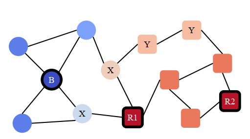

## Topology-Imbalance Learning for Semi-Supervised Node Classification

### 概念

#### QINL(Quantity-Imbalance Node Representation Learning)

* 不同种类之间的带标签节点的数量不平衡，侧重点在于带标签节点的**数量**

#### TINL(Topology-Imbalance Node Representation Learning)

* 拓扑不平衡，侧重点在于带标签节点在图上**所处的拓扑位置**
* 不同种类之间的带标签节点组成的拓扑结构往往都是**非对称**的（即使数量上平衡），可能导致存在无标签节点受不同标签的**影响冲突**
* 同类间的带标签节点分布不均匀，可能导致存在无标签节点受到的**影响过少**，供分类的信息不足
* 从研究对象上看，**TINL**独立于**QINL**，它关注决策边界上，每个带标签节点独特的拓扑位置带来的影响

### 符号说明&任务

定义无向无权图
$$
\mathcal{G}=(\mathcal{V},\mathcal{E},\mathcal{L})
$$
$\mathcal{V}$为点集，由特征矩阵$X\in R^{n\times d}$表示，$n$为节点数（样本数），$d$为特征维度。

$\mathcal{E}$为边集，由邻接矩阵$A\in R^{n\times n}$表示

$\mathcal{L}$为带标签点集，$\mathcal{L}\subset\mathcal{V}$，通常$|\mathcal{L}|\ll|\mathcal{V}|$

$\mathcal{U}$为无标签点集，$\mathcal{U}=\mathcal{V}-\mathcal{L}$

训练集中节点划分为$k$类$\{C_1,C_2,\cdots,C_k\}$

$\delta$为标签率，$\delta=\frac{|\mathcal{L}|}{|\mathcal{V}|}$

在一张同质的联通图上，面对极度**“Topology-Imbalance”**的情况下，预测$\mathcal{U}$的标签。半监督学习任务

### 拓扑不平衡

