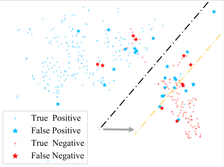

# Topology-Imbalance Learning for Semi-Supervised Node Classification

## 符号说明&任务

定义无向无权图
$$
\mathcal{G}=(\mathcal{V},\mathcal{E},\mathcal{L})
$$
$\mathcal{V}$为点集，由特征矩阵$X\in R^{n\times d}$表示，$n$为节点数（样本数），$d$为特征维度。

$\mathcal{E}$为边集，由邻接矩阵$A\in R^{n\times n}$表示

$\mathcal{L}$为带标签点集，$\mathcal{L}\subset\mathcal{V}$，通常$|\mathcal{L}|\ll|\mathcal{V}|$

$\mathcal{U}$为无标签点集，$\mathcal{U}=\mathcal{V}-\mathcal{L}$

训练集中节点划分为$k$类$\{C_1,C_2,\cdots,C_k\}$

$\delta$为标签率，$\delta=\frac{|\mathcal{L}|}{|\mathcal{V}|}$

在一张同质的联通图上，面对极度**“Topology-Imbalance”**的情况，预测$\mathcal{U}$的标签。半监督学习任务

## 概念

#### QINL(Quantity-Imbalance Node Representation Learning)

* 不同种类之间的带标签节点的数量不平衡，关注的是带标签节点的**数量**

#### TINL(Topology-Imbalance Node Representation Learning)

* 标签节点在图上的分布不平衡，关注的是带标签节点在图上**所处的拓扑位置**
* 标签节点的拓扑不平衡是普遍存在的问题（即使在数量上平衡）
* 可能导致存在无标签节点受不同标签的**影响冲突**，或者存在无标签节点受到的**影响过少**，供分类的信息不足
* 从研究对象上看，**QINL**的研究通常将同类标签节点看作一个整体，并基于每个类的总体数量来提出解决方案。而**TINL**独立于**QINL**，它关注决策边界上，每个带标签节点独特的拓扑位置带来的影响，因此**QINL**的应对策略不适用于**TINL**

## Topology-Imbalance

### 通过LPA（标签传播算法）理解Topology-Imbalance

#### Label Propagation Algorithm

在LP中，标签从带标签节点开始，沿着边传播并被聚合，可以看作是标签在图上的随机游走
$$
f^{(k+1)}=\alpha f^{(0)}+(1-\alpha)A'f^{(k)}
$$

其中

* $\alpha$是超参数，可以理解为对初始信息的保留程度；
* $A'=D^{-\frac{1}{2}}AD^{-\frac{1}{2}}$，是邻接矩阵的对称标准化形式；
* $f^{k}=\begin{pmatrix}f_1^k\\f_2^k\\\vdots\\f_n^k\end{pmatrix}$，$f_i^k$表示第$k$次迭代后节点$v_i$属于各个类的概率分布
* $f^0$将带标签节点初始化为one-hot向量，无标签节点初始化为$0$向量

令$f=\alpha f^{(0)}+(1-\alpha)A'f$，可得$f$收敛于
$$
f=\alpha(I-(1-\alpha)A')^{-1}f^0
$$

#### Influence & Boundary

$f_i$指示了节点$v_i$所属类别的概率分布，同时可以看作是带标签节点影响的分布（换句话说，节点受每个类的信息的影响程度）

考虑对$f$级数展开
$$
\begin{align}
f&=\alpha\sum_{n=0}^{\infty}(1-\alpha)^n(A')^nf^0\\
&=\alpha(I+(1-\alpha)A'+(1-\alpha)^2(A')^2+(1-\alpha)^3(A')^3+\cdots)f^0
\end{align}
$$
带标签节点对于其余节点的影响，随着拓扑距离的增大而衰弱

作者认为LP与（使用消息传递机制的）GNN存在某种程度的一致性，LP的**标签节点影响边界**一定程度上反映了GNN的**分类决策边界**

#### QINL & TINL

如果均匀随机选择来生成训练集，将同时存在数量不平衡和拓扑不平衡的问题

下图的例子中，标签数量较多的大类（蓝色）将拥有更强的影响，影响边界会向小类（红色）偏移

如果采用数量平衡策略来生成训练集，仍然存在拓扑不平衡问题

下图的例子中，由于小类（红色）有更多标签节点更靠近真实的分类边界，因此影响边界会向大类（蓝色）偏移

通过上述例子，作者认为节点不平衡下的学习同时包括了TINL和QINL，需要综合考虑两种不平衡来解决问题

### 通过influence conflict（影响冲突）来衡量Topology-Imbalance

#### Totoro（Conflict Detection-based Topology Relative Location metric)

定义一个**PageRank**矩阵$P$
$$
P=\alpha(I-(1-\alpha)A')^{-1}
$$
对于所有的**带标签节点**$v\in \mathcal{L}$，定义一个衡量influence conflict程度的Totoro指标
$$
T_v=\mathbb{E}_{x\sim P_v}[\sum_{j\in[1,k],j\ne y_v}\frac{1}{|C_j|}\sum_{i\in C_j}P_{i,x}]
$$
$T_v$越大，表示节点$v$受到的影响冲突越强烈，说明节点$v$越接近分类边界，反之则代表$v$越接近类中心，远离边界

作者用$\sum_{v\in\mathcal{L}}T_v$衡量一个数据集的总体影响冲突程度，并把它看作是图上整体拓扑不平衡程度的一种度量

作者还发现，模型的表现与图的总体冲突程度负相关

作者认为，这个现象可以进一步佐证Totoro指标（即衡量冲突程度）可以衡量在数据集层面上的拓扑不平衡的程度

#### ReNode

基于Totoro指标，设计每个标签节点$v\in \mathcal{L}$的训练权重
$$
w_v=w_{min}+\frac{1}{2}(w_{max}-w_{min})(1+cos(\frac{Rank(T_v)}{|\mathcal{L}|}\pi))
$$
* 其中，$w_{min},w_{max}$是超参数，表示权重的上下界；$Rank(T_v)$表示$T_v$在$\{T_i|i\in [1,l]\}$中的升序排名

* 容易发现，$1+cos(\frac{Rank(T_v)}{|\mathcal{L}|}\pi))$的值域为$[0,2]$，随着$T_v$的增大而单调减小（也就是$w_v$与$T_v$负相关），$w_v\in [w_{min},w_{max}]$

* 从图的角度看，对于靠近类中心的标签节点，其对应的权重更大；反之，对于靠近分类边界的标签节点，其对应的权重更小

由上，再定义监督损失函数为
$$
L_T=-\frac{1}{|\mathcal{L}|}\sum_{v\in\mathcal{L}}w_v\sum_c^ky_v^{*c}\log g_v^c\\g=softmax(\mathcal{F}(X,A,\theta))
$$
其中

* $\mathcal{F}$表示任意的GNN编码器，$\theta$为模型参数
* $g$是对模型的输出进行softmax之后的结果，$g_i$表示模型对节点$v_i$的预测结果（一个概率分布），$y_i^*$是$v_i$的真实标签（one-hot）

从式子上可以看到，$L_T$更重视对靠近类中心的标签节点的预测可靠性，而轻视在分类边界上的标签节点的预测对错

作者认为，ReNode方法是希望最小化**节点影响边界**与**真实分类边界**的误差

##### 同时解决TINL与QINL

对于数量不平衡和拓扑不平衡同时存在的图，作者认为无法将ReNode方法与现有的解决QINL的方法直接结合使用

因此，他将ReNode方法与“the vanilla class frequency-based re-weight method“结合，提出损失函数$L_Q$
$$
L_Q=-\frac{1}{|\mathcal{L}|}\sum_{v\in\mathcal{L}}w_v\frac{|\bar{C}|}{|C_j|}\sum_c^ky_v^{*c}\log g_v^c
$$
其中

* $|\bar{C}|$是所有类的标签数量的平均，$|\bar{C}|=\frac{1}{k}\sum_{j=1}^k|C_j|$
* $C_j$应该是标签节点$v$所属的类别

从式子上看，越靠近类中心、所属类别中标签数量越少的标签节点被赋予更大训练权重；反之，越靠近边界、所属类别中标签数量越多的就被赋予更小的权重

##### 在大规模图中使用ReNode

在large-scale graph上，主要需要解决两个问题：（1）如何计算PageRank矩阵P （2）如何训练模型

计算PageRank矩阵$P$

训练模型
$$
g'=softmax(\hat{P}\mathcal{F'}(X,\theta'))
$$
